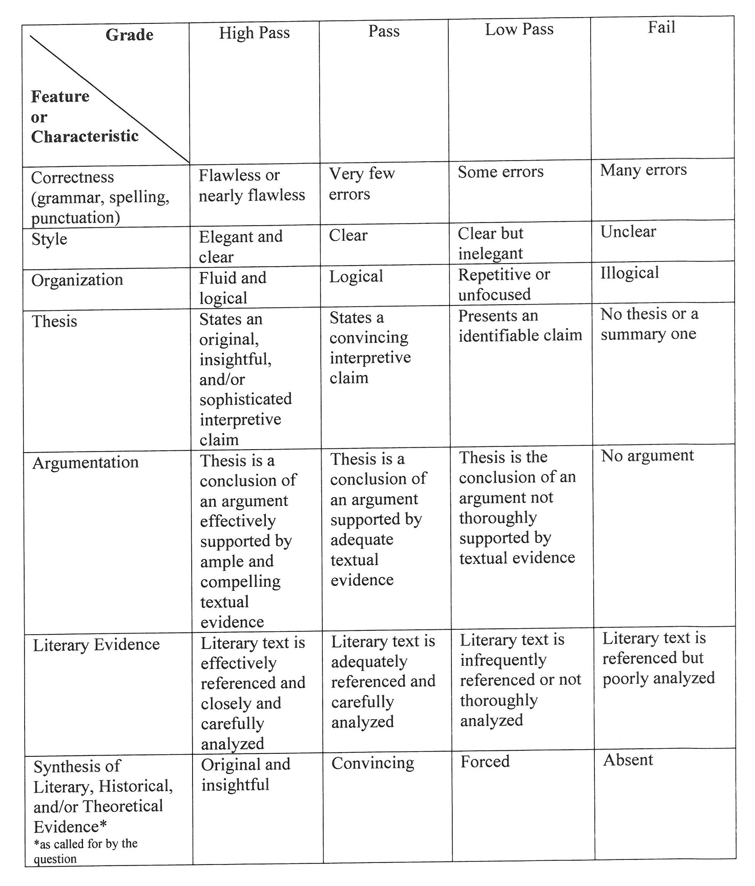

Basic policies regarding the M.A. Examination are contained within the [University Academic Catalog](https://catalog.luc.edu/graduate-professional/graduate-school/arts-sciences/english/english-ma/#curriculumtext), under "M.A. Qualifying Examination."

# General Instructions

- The exam comprises two two-hour periods, 10:00am--12:00pm and 1:00pm--3:00pm. Exam dates are announced by the Graduate Programs Director, usually three months in advance.
- In each two-hour period, students write one essay, responding to one of the prompts presented in that exam period. Essay prompts are drawn from a standard list of [Exam Questions]. Students should identify clearly the prompt to which they respond.
- At the beginning of the exam, students are presented with a collection of passages and a list of texts. The passages and the texts are drawn from graduate courses offered during the period in which students were enrolled in the M.A. program. Essay responses to question (1) must be centered on one of the supplied passages. Essay responses to questions (2)--(6) must be centered on one or more of the texts in the supplied list of texts.
- There are no fixed requirements regarding the length of an essay. Most are between 5 and 7 pages in length, double spaced.
- Students are permitted to consult course readings only; outside research is not permitted.
- Parenthetical citations are sufficient; a list of works cited is not expected.
- Students must not write about the same work or author in both essays.

\newpage

# Exam Questions

Questions on the M.A. Exam are drawn from the following standard set.

(@) **Close reading.** Choose one of the supplied passages. Make an argument or claim about the work from which the passage is taken, supported by a close reading of the passage. You may refer to other passages from the same text but your response must be centered in an analysis of details of the passage selected.

(@) **Historical and cultural contexts.** From the list supplied, select two works from different historical periods. Write an essay in which you compare these works in terms of a specific issue, showing the difference their historical and/or cultural contexts makes to the way the issue is presented. For example, you might consider their different concepts of a literary work; their representations of class, gender, or nationality; or their stylistic differences.

(@) **Secondary sources.** Select one work from the list supplied. Identify a critical problem or debate in secondary scholarship on this work, which may include textual scholarship. Write an essay in which you explain the different readings of this issue, then take a position in this debate, using textual evidence to support your reading.

(@) **Literature and theory (A).** From the list supplied, select two literary works from different historical periods. Write an essay in which you demonstrate how a theoretical text or approach inflects our reading of the literary works as well as how the literary works may alter our understanding of the theory. Your answer might single out literary theories pertaining to language, gender, sexuality, postcolonialism, or textuality and media. It should include a detailed interpretation of both the literary works and the theory.

(@) **Literature and theory (B).** From the list supplied, choose two theoretical works and discuss how they respond differently to the question of what it means to read a text. You might focus on the different ways these theorists conceptualize a literary work, a literary period or periodization as such, the concept of an author, the concept of originality, or the political function of a text. Illustrate these differences through a reading of one literary work from the list supplied.

(@) **Pedagogy.** Choose one of the texts supplied and explain how you would introduce this text to a class, whether in a graduate seminar where you are giving a presentation, or in an undergraduate literature course where you are the instructor-of-record. Then, in the second part of the essay, reflect on why you chose to introduce the text that way. Whether you approach the text via theory, history, genre, textual studies, or some combination, be sure to specify the level of the course, and to cite specific secondary material you would have students read in relation to this work, and why. You may choose to discuss specific pedagogical theories in providing an explanation for your introduction.

# Grading Rubric and Communication of Results

Exams are graded by members of the MA Exam Committee using the rubric below.
Exam results and the committee's comments are transmitted to students by the GPD.

